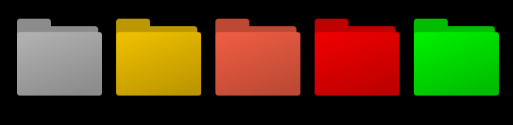
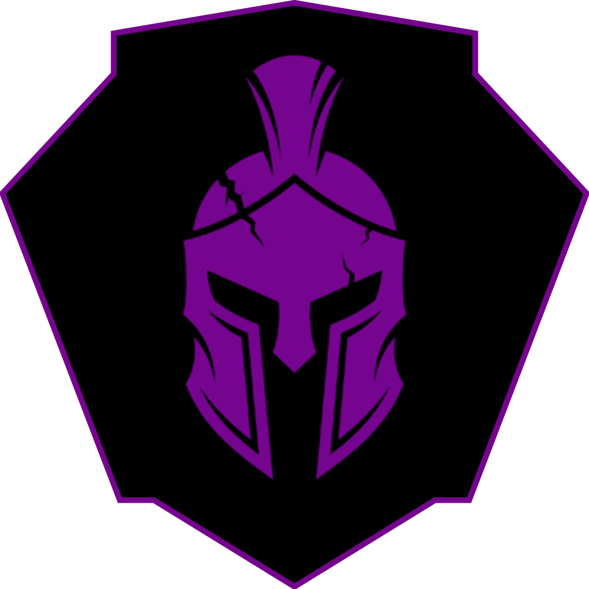

<p align="center">
  
  <!-- <h1 align="center">GymStreak</h1> -->
  <p align="center">Customizable folder component using Web Components and color-blended PNG layers.</p>
</p>

<p align="center">
  
  
  
</p>

## 🔧 Features

- 📁 Custom Folder Component (Web Component / Shadow DOM)
- 🎨 Fully customizable colors (hex, rgb, rgba, hsl, named colors)
- 🖼️ PNG texture support with preserved gradients and shading

## 📸 Preview

<p align="center">
  
</p>

## ✍️ How to use it
``` html
<app-fldr></app-fldr>                             <!-- Standard -->
<app-fldr color="#ffcc00"></app-fldr>             <!-- Hex code -->
<app-fldr color="tomato"></app-fldr>              <!-- Color name -->
<app-fldr color="rgb(255, 0, 0)"></app-fldr>      <!-- RGB -->
<app-fldr color="hsl(120, 100%, 50%)"></app-fldr> <!-- HSL -->

<script src="main.js" defer></script>
```
<p align="center">

</p>
