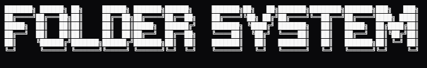
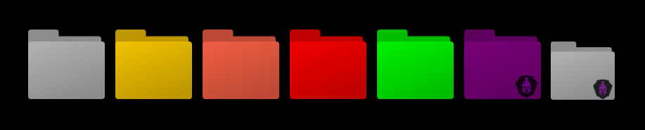

<p align="center">
  
  <p align="center">Customizable folder component using Web Components and color-blended PNG layers.</p>
</p>

<p align="center">
  
  
  
</p>

## 🔧 Features

- 📁 Custom Folder Component (Web Component / Shadow DOM)
- 🎨 Fully customizable colors (hex, rgb, rgba, hsl, named colors)
- 🖼️ PNG texture support with preserved gradients and shading
- 📐 Dynamic sizing with --folder-size CSS variable
- 🛡️ Adaptive icon & emblem scaling

## 📸 Preview

<p align="center">
  
</p>

## ✍️ How to use it
``` html
<app-fldr></app-fldr> <!-- Standard -->
<app-fldr color="#ffcc00"></app-fldr> <!-- Hex code -->
<app-fldr color="tomato"></app-fldr> <!-- Color name -->
<app-fldr color="rgb(255, 0, 0)"></app-fldr> <!-- RGB -->
<app-fldr color="hsl(120, 100%, 50%)"></app-fldr> <!-- HSL -->

<app-fldr color="#800080" icon="img/foldersystem2.png"></app-fldr> <!-- Icon -->
<app-fldr style="--folder-size: 100px" icon="img/foldersystem2.png"><app-fldr> <!-- Icon -->


<script src="main.js" defer></script>